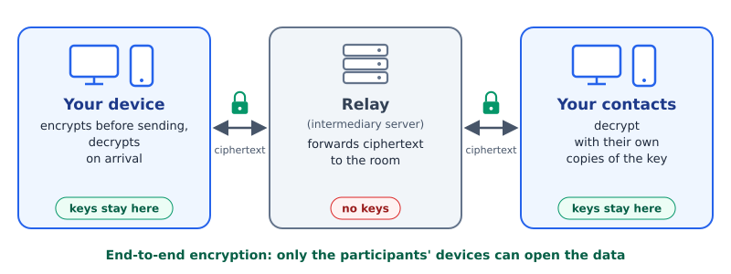
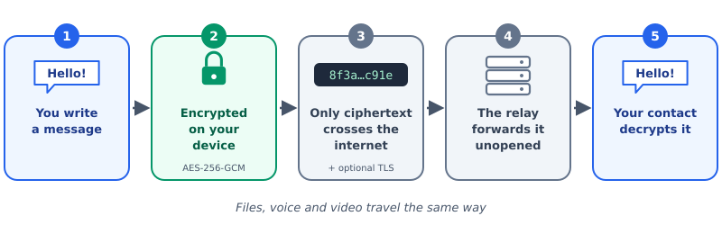
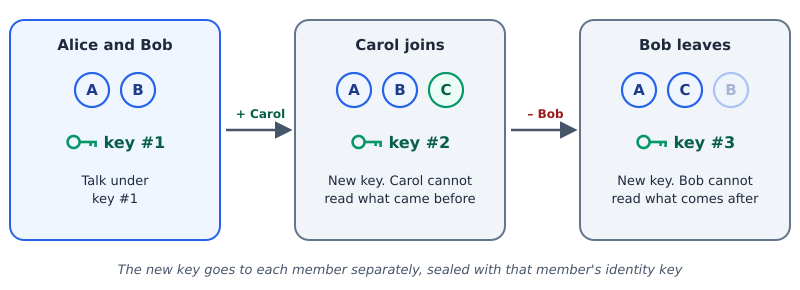
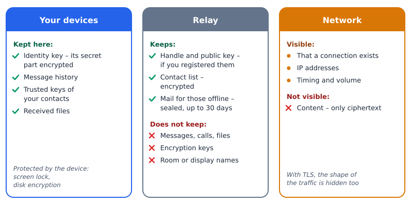
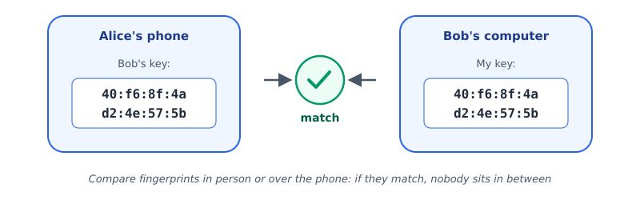

# How F.E.A.R. Works

*A plain explanation with diagrams: what happens to your messages, where they are kept, and why outsiders cannot read them. Version 0.6.0.*

## In short

- **Everything is encrypted on your device.** Messages, files, voice and video leave your phone or computer already encrypted and are decrypted only on your contacts' devices.
- **The server is only an intermediary.** The relay forwards encrypted data, but it has no keys and cannot read it.
- **The server does not see room names or names.** Instead of the room name it sees a hash; instead of your name, a random tag that is new on every connection.
- **The room key changes by itself** whenever someone joins or leaves: a newcomer cannot read the past, and someone who left cannot read the future.
- **Your messages are kept only by you.** The one exception is mail for contacts who are offline: it waits on the server, sealed, and is deleted once delivered.

## 1. What the system is made of

There are three parties: **your device**, the **relay**, and **your contacts' devices**.

All the cryptographic work is done by the application on your computer or phone. The relay is an intermediary server that lets devices find each other on the internet: it receives encrypted data and passes it to the members of the same room. The relay may belong to the project's authors or to you – your own takes one command to start.

## 2. The journey of one message

1. You type a message. While it is on your screen, it exists only on your device.
2. The application encrypts it with **AES-256-GCM** under the room key. Without the key the ciphertext cannot be told apart from random bytes, and changing even one bit is detected on decryption.
3. Only ciphertext crosses the internet. Optionally, the connection to the relay is wrapped in **TLS** – a second layer of encryption that also hides the shape of the traffic from your provider: the sizes and rhythm of the data by which F.E.A.R. could be recognised.
4. The relay forwards the ciphertext to the members of the room without opening it.
5. Your contact's device decrypts the message with its own copy of the key and shows the text.

## 3. Keys: what locks your conversations

| Key | What it is | Where it lives |
|-----|------------|----------------|
| **Identity key** | A key pair – your digital passport. The private key signs "I wrote this", the public key lets anyone check the signature | The private key never leaves your device and is encrypted by the system key store. Your contacts know the public key |
| **Room key** | A key shared by the members of a group | On the members' devices. A newcomer receives it through Diffie–Hellman key exchange (X25519), signed with an identity key |
| **Personal chat key** | A key for two | Computed on each of the two devices from the identity keys; never sent over the network |
| **Call key** | One per participant, per call | On the participants' devices; erased after the call |

### The room key changes by itself

When someone joins or leaves, one member – every device picks the same one by the same rule – creates a new room key and sends it to each member separately, sealed with that member's public key. A newcomer therefore cannot read what was written before they arrived, and someone who left cannot read what is written after.

## 4. Where data is kept

| Data | Where | How it is protected |
|------|-------|---------------------|
| Messages and received files | Only on your devices | By the device: on a phone, storage encryption and the screen lock; on a computer, the permissions of your user account. Turning on disk encryption is recommended |
| Identity key | On your device | The private part is encrypted by the system key store (Windows, Linux) or the Android Keystore. Where there is no key store, the file is readable only by your user account |
| Identity backup | Wherever you save it: a file or a QR code | Encrypted with your password – at least 12 characters |
| Contact list | A copy on the relay | Encrypted with a key only your device knows |
| Mail for contacts who are offline | On the relay until delivered, no longer than the operator allows (30 days by default) | Sealed with the pair's key; the server cannot link the mailbox address to people |
| Handle (name@server) | On the relay, if you registered one | Public by design – it is your "address" for contacts. Your public key is stored with it |

## 5. Calls

Voice and video travel the same way as messages: through the relay, encrypted. Every participant has a key of their own for the call, and packets that were captured and sent again are discarded. Optionally a call can go directly between devices – the path is shorter, but the other side learns your IP address, so this is off by default.

## 6. Making sure you are talking to the right person

Every identity key has a **fingerprint** – a short string computed from the public key by a hash function. It is the same on a computer and on a phone. Compare fingerprints with your contact in person or over the phone: if they match, nobody in between has swapped the keys. If your contact's key ever changes, the application warns you.

## 7. What F.E.A.R. does not hide

An honest list of limits:

- **That and when you communicate.** The relay and your provider see that your device is connected, its IP address, the timing and the volume. A VPN, Tor or your own relay help hide this.
- **A compromised device.** Encryption protects data in transit and on the server. Malware on the device itself can read what you can read.
- **A stolen room key** lets the thief read the room until the next key change.
- **A simple room name** ("general") can be guessed by hashing candidates. For a private group, pick a name that is hard to guess.

## Glossary

- **Encryption** – transforming data so that only the holder of the key can read it.
- **End-to-end encryption** – encryption from the sender's device to the recipient's device; intermediaries see only ciphertext.
- **Key** – a secret 256-bit number. Guessing it by trying all values is impossible: all the computers in the world would need longer than the age of the Universe.
- **Public and private key** – a key pair: the private key stays with its owner, the public key can be shown to anyone.
- **Digital signature** – proof that data was created by the holder of a private key and has not been altered.
- **Hash function** – computing a short "fingerprint" of data; the data cannot be recovered from it.
- **Relay** – an intermediary server that forwards encrypted data between devices.
- **TLS** – the standard protocol for securing a connection, the same as in https:// addresses.
- **AES-256-GCM** – an international encryption standard with built-in integrity checking.

*More in the user manual (doc/manual.pdf) and the [project Wiki](https://github.com/shchuchkin-pkims/fear/wiki).*
