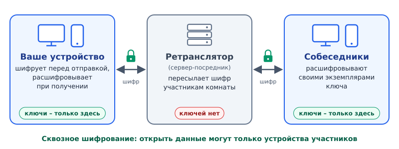
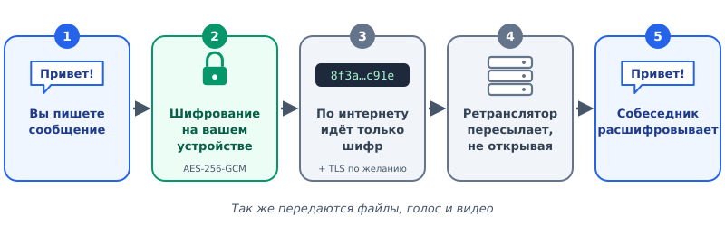
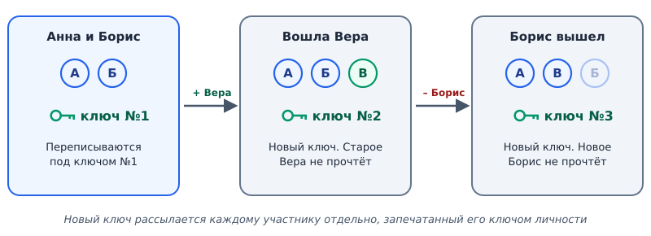
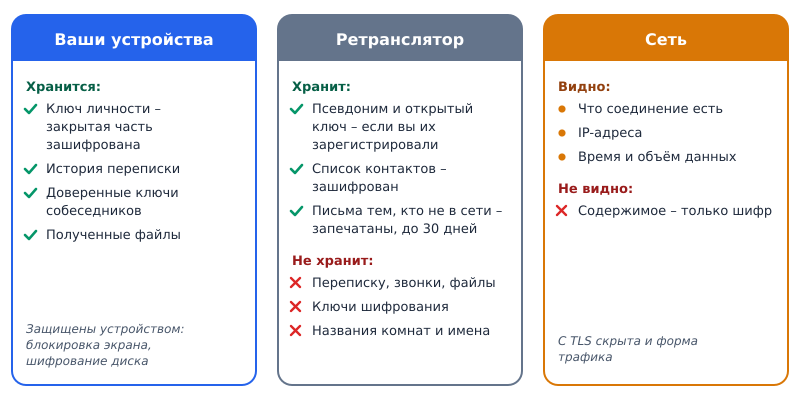
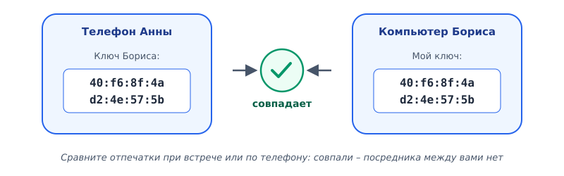

# Как устроен F.E.A.R.

*Простое объяснение со схемами: что происходит с вашими сообщениями, где они хранятся и почему посторонние не могут их прочитать. Версия 0.6.0.*

## Коротко

- **Всё шифруется на вашем устройстве.** Сообщения, файлы, голос и видео покидают телефон или компьютер уже зашифрованными, а расшифровываются только на устройствах собеседников.
- **Сервер – только посредник.** Ретранслятор пересылает зашифрованные данные, но ключей у него нет, и прочитать их он не может.
- **Сервер не видит названий комнат и имён.** Вместо названия комнаты – хеш, вместо имени – случайная метка, новая при каждом подключении.
- **Ключ комнаты меняется сам**, когда кто-то входит или выходит: новичок не прочтёт прошлое, ушедший – будущее.
- **Переписка хранится только у вас.** Исключение – письма тем, кто не в сети: они ждут на сервере в запечатанном виде и удаляются после доставки.

## 1. Из чего состоит система

Участников три: **ваше устройство**, **ретранслятор** и **устройства собеседников**.

Всю криптографическую работу делает приложение на вашем компьютере или телефоне. Ретранслятор – сервер-посредник: он нужен, чтобы устройства находили друг друга в интернете. Он принимает зашифрованные данные и передаёт их участникам той же комнаты. Ретранслятор может принадлежать авторам проекта, а может – вам: свой запускается одной командой.

## 2. Путь одного сообщения

1. Вы набираете текст. Пока он на экране, он существует только на вашем устройстве.
2. Приложение шифрует его алгоритмом **AES-256-GCM** ключом комнаты. Без ключа шифр неотличим от случайного набора байтов, а подмена хотя бы одного бита обнаруживается при расшифровке.
3. По интернету идёт только шифр. По желанию соединение с ретранслятором дополнительно оборачивается в **TLS** – второй слой шифрования, который скрывает от провайдера и форму трафика: размеры и ритм данных, по которым можно узнать F.E.A.R.
4. Ретранслятор пересылает шифр участникам комнаты, не открывая его.
5. Устройство собеседника расшифровывает сообщение своим экземпляром ключа и показывает текст.

## 3. Ключи: чем запирается переписка

| Ключ | Что это | Где находится |
|------|---------|---------------|
| **Ключ личности** | Пара ключей – ваш цифровой паспорт. Закрытый ставит подпись «это написал я», открытый позволяет любому её проверить | Закрытый – только на вашем устройстве, зашифрован системным хранилищем ключей. Открытый знают собеседники |
| **Ключ комнаты** | Общий ключ участников группы | На устройствах участников. Новичку передаётся по протоколу обмена ключами Диффи–Хеллмана (X25519), с подписью ключом личности |
| **Ключ личной переписки** | Ключ для двоих | Вычисляется на каждом из двух устройств из ключей личности; по сети не передаётся никогда |
| **Ключ звонка** | Свой у каждого участника на каждый звонок | На устройствах участников; стирается после звонка |

### Ключ комнаты меняется сам

Когда кто-то входит или выходит, один из участников – все устройства выбирают его по одному и тому же правилу – создаёт новый ключ комнаты и отправляет каждому отдельно, запечатав открытым ключом получателя. Поэтому новичок не может прочитать то, что писали до него, а ушедший – то, что напишут после.

## 4. Где хранятся данные

| Данные | Где | Как защищены |
|--------|-----|--------------|
| Сообщения и полученные файлы | Только на ваших устройствах | Средствами устройства: на телефоне – шифрованием памяти и блокировкой экрана, на компьютере – правами вашей учётной записи. Советуем включить шифрование диска |
| Ключ личности | На вашем устройстве | Закрытая часть зашифрована системным хранилищем ключей (Windows, Linux) или Android Keystore. Где хранилища нет, файл доступен только вашей учётной записи |
| Резервная копия ключа | Там, где вы её сохраните: файл или QR-код | Зашифрована вашим паролем – не короче 12 символов |
| Список контактов | Копия на ретрансляторе | Зашифрован ключом, который знает только ваше устройство |
| Письма тем, кто не в сети | На ретрансляторе – до доставки, но не дольше срока, заданного владельцем сервера (по умолчанию 30 дней) | Запечатаны ключом пары; адрес ящика сервер не может связать с людьми |
| Псевдоним (имя@сервер) | На ретрансляторе, если вы его зарегистрировали | Это открытые данные – ваш «адрес» для контактов. Вместе с ним хранится ваш открытый ключ |

## 5. Звонки

Голос и видео идут тем же путём, что и сообщения: через ретранслятор и в зашифрованном виде. У каждого участника звонка свой ключ на этот звонок, а перехваченные и отправленные повторно пакеты отбрасываются. По желанию звонок можно вести напрямую между устройствами – путь короче, но собеседник узнает ваш IP-адрес, поэтому по умолчанию это выключено.

## 6. Как убедиться, что вы говорите с тем, с кем нужно

У каждого ключа личности есть **отпечаток** – короткая строка, вычисляемая хеш-функцией из открытого ключа. На компьютере и телефоне он одинаков. Сравните отпечатки с собеседником при встрече или по телефону: если совпадают, между вами нет посредника, подменившего ключи. Если ключ собеседника когда-нибудь изменится, приложение предупредит.

## 7. Чего F.E.A.R. не скрывает

Честный список ограничений:

- **Факт и время общения.** Ретранслятор и провайдер видят, что ваше устройство подключено, его IP-адрес, время и объём передачи. Скрыть это помогают VPN, Tor или собственный ретранслятор.
- **Захваченное устройство.** Шифрование защищает данные в пути и на сервере. Вредоносная программа на самом устройстве может прочитать то же, что и вы.
- **Украденный ключ комнаты** позволит читать комнату до следующей смены ключа.
- **Простое название комнаты** («general») можно угадать перебором хешей. Для закрытой группы выбирайте название, которое трудно угадать.

## Словарь

- **Шифрование** – преобразование данных, после которого прочитать их может только владелец ключа.
- **Сквозное шифрование** – шифрование от устройства отправителя до устройства получателя; посредники видят только шифр.
- **Ключ** – секретное число длиной 256 бит. Подобрать его перебором невозможно: всем компьютерам мира не хватило бы на это времени, прошедшего с рождения Вселенной.
- **Открытый и закрытый ключ** – пара ключей: закрытый хранится у владельца, открытый можно показывать всем.
- **Цифровая подпись** – доказательство, что данные создал владелец закрытого ключа и их никто не изменил.
- **Хеш-функция** – вычисление короткого «отпечатка» данных; по отпечатку нельзя восстановить исходные данные.
- **Ретранслятор** – сервер-посредник, пересылающий зашифрованные данные между устройствами.
- **TLS** – стандартный протокол защиты соединения, тот же, что в адресах https://.
- **AES-256-GCM** – международный стандарт шифрования с проверкой целостности данных.

*Подробнее – в руководстве пользователя (doc/manual.pdf) и в [вики проекта](https://github.com/shchuchkin-pkims/fear/wiki).*
